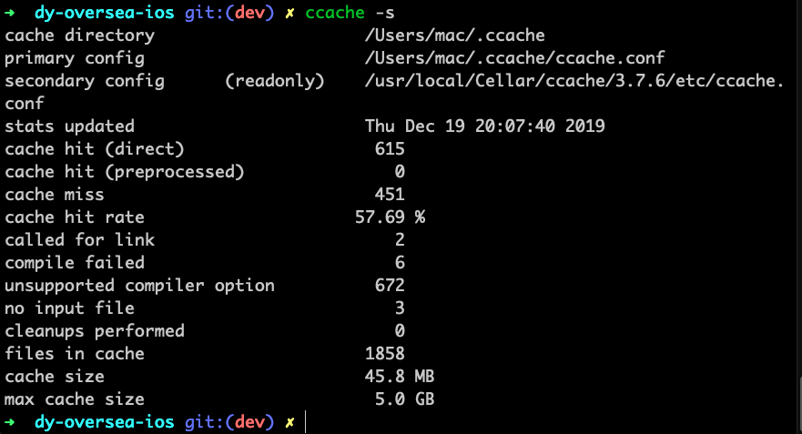

# 优化编译速度实践记录 {docsify-ignore-all}

## 1. 使用`CCache`编译缓存工具

- 安装`ccache`
 ```shell
  brew install ccache
 ```
- 到项目根目录,`touch ccache-clang`编写脚本(`C++`混编项目需要多增加一套脚本`ccache-clang++`)
```shell
  #!/bin/sh
  if type -p ccache >/dev/null 2>&1; then
    export CCACHE_MAXSIZE=10G
    export CCACHE_CPP2=true
    export CCACHE_HARDLINK=true
    export CCACHE_SLOPPINESS=file_macro,time_macros,include_file_mtime,include_file_ctime,file_stat_matches
    
    # 指定日志文件路径到桌面，等下排查集成问题有用，集成成功后删除，否则很占磁盘空间
    export CCACHE_LOGFILE='~/Desktop/CCache.log'
    exec ccache /usr/bin/clang "$@"
  else
    exec clang "$@"
  fi
```
集成`c++`混编的脚本需增加如下脚本:
```shell
  #!/bin/sh
  if type -p ccache >/dev/null 2>&1; then
    export CCACHE_MAXSIZE=10G
    export CCACHE_CPP2=true
    export CCACHE_HARDLINK=true
    export CCACHE_SLOPPINESS=file_macro,time_macros,include_file_mtime,include_file_ctime,file_stat_matches
    
    # 指定日志文件路径到桌面，等下排查集成问题有用，集成成功后删除，否则很占磁盘空间
    export CCACHE_LOGFILE='~/Desktop/CCache.log'
    exec ccache /usr/bin/clang++ "$@"
  else
    exec clang++ "$@"
  fi
```

 写完把执行权限打开 `chmod 777 ccache-clang`   `chmod 777 ccache-clang++`

- 自定义`User-Defined`字段`CC`，如下图，并设置值为`$(SRCROOT)/ccache-clang`，可根据自己情况设置`Debug/Release`下的，对我来说只是设置`Debug`，因为增量编译节省编译时间从而提升编程效率

  

- 对于`pods`里面的第三方框架也需要添加优化，在`Podfile`文件末尾里添加如下代码:

  ```ruby
  post_install do |installer_representation|
    installer_representation.pods_project.targets.each do |target|
      target.build_configurations.each do |config|      
        # 在生成的 Pods 项目文件中加入 CC 参数，路径的值根据你自己的项目来修改
        config.build_settings['CC'] = '$(PODS_ROOT)/../ccache-clang'
      end
    end
  end
  ```

- 差不多最终效果就是第一次编译时间久一些，第二次秒开，据说`pch`里的东西不怎么改的话，效果会很明显。命令行执行`ccache -s` 查看缓存命中率，如图所示:

  

- 对于长期被垃圾机器支配下的开发者来说，使用体验还是可以的~ 

  

  
  
  

##  参考博客列表

1. [iOS 微信编译速度优化分享](https://mp.weixin.qq.com/s/-wgBhE11xEXDS7Hqgq3FjA)
2. [Xcode使用CCache提高编译和打包效率](https://www.jianshu.com/p/2bbcea9ec5d7)
3. [[贝聊科技]如何将 iOS 项目的编译速度提高5倍](https://www.jianshu.com/p/67bf747658fe)
4. [用ccache让Xcode运行、打包飞起来](https://www.jianshu.com/p/b61f182f75d2)
5. [优化 iOS 项目的构建时间](https://toutiao.io/posts/9gd1v7/preview)


  