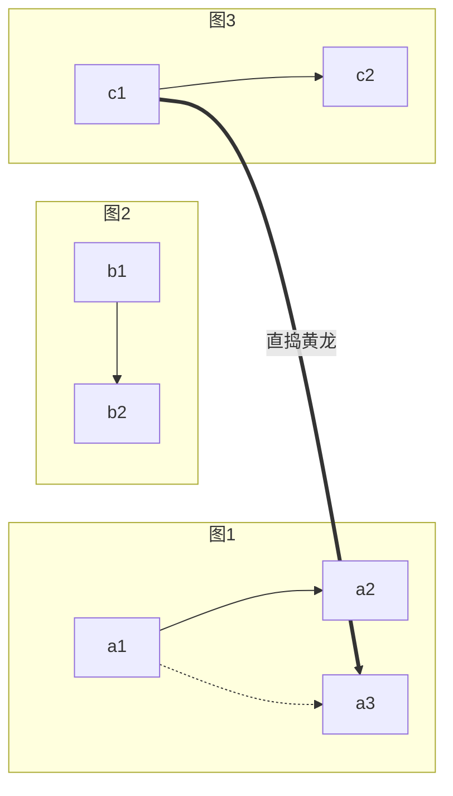
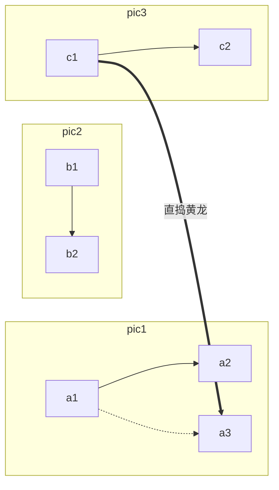
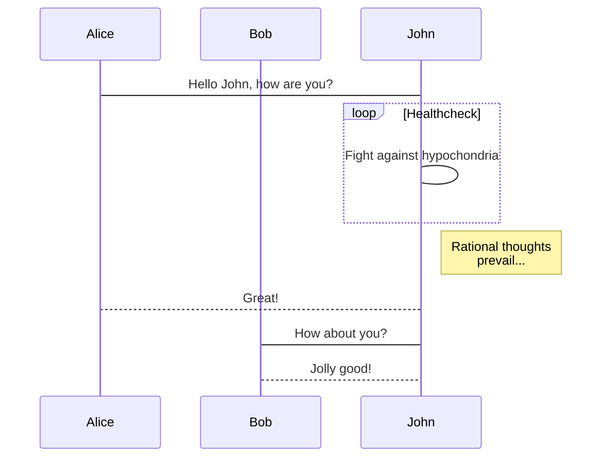
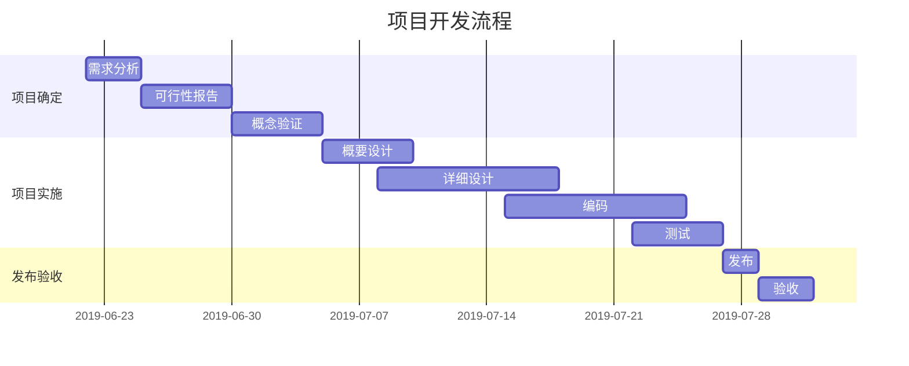

# Markdown 绘图插件之 Mermaid 语法
[具体用法结合文档](https://docsify.js.org/#/zh-cn/markdown?id=%e6%94%af%e6%8c%81-mermaid)
> docsify对mermaid的支持需要导入对应的库进行使用
> 
>  `<link rel="stylesheet" href="//cdn.jsdelivr.net/npm/mermaid/dist/mermaid.min.css">`
>  `<script src="//cdn.jsdelivr.net/npm/mermaid/dist/mermaid.min.js"></script>`
>  JS调用  
```javascript
 mermaid.initialize({
            startOnLoad: false
        });
```

### 流程图示例
*例如从左到右的一个有向图*
```mermaid
graph LR;
A[aa bb]-->B(wo);
A-->C((我是C));
B-->D>我是D];
C-->D;
D-->E{我是E};
C-->E;
6-->E;
=-->E;
A== 哈哈 ==>E;
Q-.->A;
Q-. 虚线注释 .-B;
Q==粗线==>C;
Q--注释一波-->E;
```
<pre>
<code>
```mermaid
graph LR;
A[aa bb]-->B(wo);
A-->C((我是C));
B-->D>我是D];
C-->D;
D-->E{我是E};
C-->E;
6-->E;
=-->E;
A== 哈哈 ==>E;
Q-.->A;
Q-. 虚线注释 .-B;
Q==粗线==>C;
Q--注释一波-->E;
``` 
</code>
</pre>


`graph` 指的是图，其中`LR`是指的是从左到右的方向 
方向关键词:
* TB - top bottom
* BT - bottom top
* RL - right left
* LR - left right
* TD - same as TB

### 图形形状

| 形状  |  符号代码 |
|---|---|
|圆形   |            ((文字))   | 
|矩形   |            默认是矩形 [文字] |
|圆角矩形   |            (文字) |
|菱形   |            {文字}     |
|六边形  |            {{文字}} |
|类似鱼尾巴   |            >文字] |

### 子图嵌套使用

<pre>
<code>

</code>
</pre>

### 序列图示例


### 甘特图示例
>**甘特图**内在思想简单。基本是一条线条图，横轴表示时间，纵轴表示活动（项目），线条表示在整个期间上计划和实际的活动完成情况。它直观地表明任务计划在什么时候进行，及实际进展与计划要求的对比。



### 参考 

| **参考标题**                               | **链接地址**             |
|------------------------------------  | ------------------ |
| Arya - 在线 Markdown 编辑器           |   https://markdown.lovejade.cn  |
| mermaid 语法             |   https://www.cnblogs.com/dao0/p/4489837.html  |
| Markdown 绘图插件之 Mermaid 语法  |   http://blog.lisp4fun.com/2017/11/21/mermaiduse  |
| Github 博客画流程图 |   http://blog.lisp4fun.com/2017/11/09/mermaid-flow  |
| mermaid 开源库地址 |   https://github.com/mermaid-js/mermaid   |


