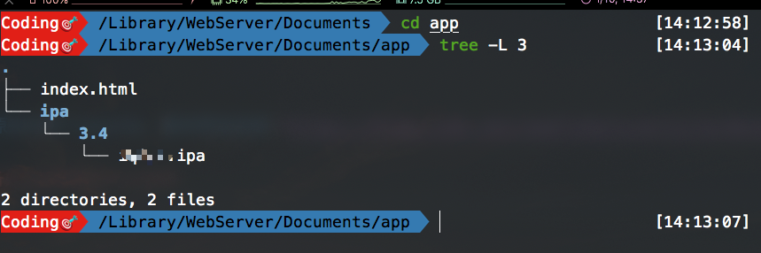
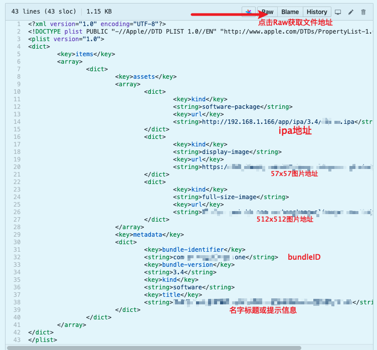

# 局域网部署OTA安装内测ipa包


最终效果如图，必须要使用`safari`打开,`plist`文件的地址必须支持`https`(这里采用了业界取巧的方式托管在`github`上)，点击【安装】按钮之后，才会弹窗 【取消】-【安装】
*关键代码*
```html
<a href="itms-services://?action=download-manifest&url=https://raw.githubusercontent.com/xxx/MyPlists/master/manifest_v3.4.plist"> 安装 </a>
```
> 借助了苹果的OTA协议(企业签名或者第三方分发都是采用这种方式) `itms-services://?action=download-manifest&url= `
> OTA升级什么意思？
> OTA升级对于很多手机爱好者朋友来说，都不会陌生，很多安卓手机或者iPhone手机都支持OTA升级，直白的说，OTA升级就是在线升级手机系统的意思

#### 搭建本地webServer
**其实Mac自带apache服务,只是需要一个起手式就能开启服务**
```shell
#!/bin/bash
webServer() {
    echo "======================================"
	echo "请选择需要执行的apache命令选项"
	echo "0. 开启apache "
	echo "1. 重启apache"
	echo "2. 关闭apache"
	echo "3. 部署目录或者文件到apache根目录"
	echo "======================================"
	
	read -p "输入选项编号：" number
	case $number in 
		0) startApache	
		;;
			
		1) restartApache	
		;;
		
		2) stopApache	
		;;

		3) movePathToApache	
		;;

	esac	
 }
#开启
startApache (){
	sudo /usr/sbin/apachectl start
}
#重启
restartApache (){
	sudo /usr/sbin/apachectl restart
}
#停止
stopApache (){
	sudo /usr/sbin/apachectl stop
}

#部署
movePathToApache (){
	read -p "输入需要部署的项目路径: " root_proj_dir
	webServer_dir="/Library/WebServer/Documents" 
	sudo cp -R ${root_proj_dir} ${webServer_dir}
	echo "已部署至127.0.0.1目录下"
	open /Library/WebServer/Documents
}

####################################################
webServer

```

[Mac OS原来自带了apache，基本用法总结](https://blog.csdn.net/seafishyls/article/details/44546809)

#### 准备好ipa包和plist文件
 先上图，再解释
 
* 部署到`/Library/WebServer/Documents`目录下即可
* 查看本机`ip` , 根据`ipa`实际路径得出`URL`地址 `192.168.1.101/app/ipa/3.4/xxx.ipa` 
* 把URL配置到`manifest.plist`文件中的`ipa`地址

 
*需要配置以下几个配置:*
  * 应用的`bundleID`
  * `app`的应用名称
  * `57x57`和`512x512`的`logo`图标
  * 安装时弹窗标题`title`


#### 上代码 

* html页面

```html
<!doctype html>
<html>
<head>
    <meta http-equiv="Content-Type" content="text/html; charset=UTF-8" />
    <!-- 收藏到桌面时显示的图标 -->
    <link rel="apple-touch-icon" sizes="57x57" href="https://apk-hk.oss-cn.aliyuncs.com/xxx/IOS/512.png" />
    <link rel="apple-touch-icon" sizes="72x72" href="https://apk-hk.oss-cn.aliyuncs.com/xxx/IOS/512.png" />
    <link rel="apple-touch-icon" sizes="114x114" href="https://apk-hk.oss-cn.aliyuncs.com/xxx/IOS/512.png" />  
    <link rel="apple-touch-icon" sizes="144x144" href="https://apk-hk.oss-cn.aliyuncs.com/xxx/IOS/512.png" />
    <title>内测分发测试</title>
    <style>   
        .download {
            width: 512px;
            height: 100px;
            line-height: 100px;
            background-color: brown;
            color: white;
            font-size: 35px;
            text-align: center;
            margin: 10px auto;
            border-radius: 50px;
        }
        #img {
            margin: 150px auto 10px auto;
            text-align: center;
        }
        a {
            text-decoration: none;
            color: white;
        }
    </style>
</head>

<body>
    <div id="img">
        <!-- logo图标地址换成你自己的 -->
        
    </div>
    <div class="download">
        <!-- https://raw.githubusercontent.com/xxx/MyPlists/master/manifest_v3.4.plist需修改成自己的plist地址  -->
        <a href="itms-services://?action=download-manifest&url=https://raw.githubusercontent.com/xxx/MyPlists/master/manifest_v3.4.plist"> 安装 </a>
    </div>
</body>
</html>
```

* manifest.plist

```xml
<?xml version="1.0" encoding="UTF-8"?>
<!DOCTYPE plist PUBLIC "-//Apple//DTD PLIST 1.0//EN" "http://www.apple.com/DTDs/PropertyList-1.0.dtd">
<plist version="1.0">
<dict>
	<key>items</key>
	<array>
		<dict>
			<key>assets</key>
			<array>
				<dict>
					<key>kind</key>
					<string>software-package</string>
					<key>url</key>
                    <!-- 替换自己的ipa地址 -->
					<string>http://192.168.1.166/app/ipa/3.4/xxx.ipa</string>
				</dict>
				<dict>
					<key>kind</key>
					<string>display-image</string>
					<key>url</key>
                    <!-- 57x57小图标 -->
					<string>https://xxxx/57.png</string>
				</dict>
				<dict>
					<key>kind</key>
					<string>full-size-image</string>
					<key>url</key>
                    <!-- 512x512大图标 -->
					<string>https://xxx/512.png</string>
				</dict>
			</array>
			<key>metadata</key>
			<dict>
				<key>bundle-identifier</key>
                <!-- 修改BundleId -->
				<string>com.xxx.hehe</string>
				<key>bundle-version</key>
                <!-- 修改实际版本号 -->
				<string>3.4</string>
				<key>kind</key>
				<string>software</string>
				<key>title</key>
                <!-- 弹窗标题 可加一些提示 不宜太长 -->
				<string>xxx(如果安装失败:卸载旧版本,或者请到开发人员处添加UDID)</string>
			</dict>
		</dict>
	</array>
</dict>
</plist>

```

以上～